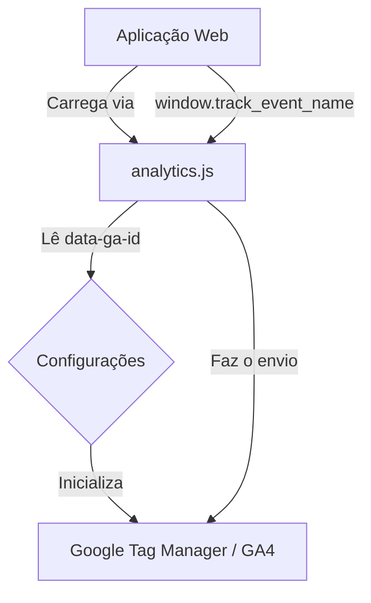

# Centralized Web Analytics

Solução centralizada e leve para implementação do Google Analytics 4 (GA4) em qualquer site ou aplicação web.

## Visão Geral

Este repositório fornece um script JavaScript standalone que simplifica a integração do GA4. Em vez de configurar o `gtag.js` manualmente em cada projeto, você carrega este script remoto que gerencia a inicialização, configuração e oferece uma API unificada para rastreamento de eventos.

### Por que usar?
- **Configuração Única:** Gerencie a lógica de analytics em um só lugar.
- **Agnóstico a Framework:** Funciona em Next.js, React, Vue, Svelte ou HTML puro.
- **Fácil Manutenção:** Atualize o script central para refletir mudanças em todos os produtos.
- **Segurança:** Proteções contra carregamento duplicado e falhas silenciosas.

---

## Como funciona (Arquitetura)



O script detecta automaticamente seus atributos `data-*` no momento do carregamento e injeta a biblioteca oficial do Google `gtag.js` dinamicamente.

---

## Como Hospedar o Script

Para que o script seja "remoto", ele precisa estar disponível em uma URL pública (CDN).

### 1. Vercel / Netlify / Cloudflare Pages
- Faça o deploy deste repositório.
- O script ficará acessível em: `https://seu-dominio.com/analytics.js`

### 2. AWS S3 + CloudFront
- Suba o arquivo `analytics.js` para um bucket S3.
- Configure o CloudFront para servir o arquivo com cache agressivo.

---

## Como Usar

### 1. HTML Puro
Basta adicionar a tag script no `<head>` ou antes do fechamento do `</body>`.

```html
<script
  src="https://sua-cdn.com/analytics.js"
  data-ga-id="G-XXXXXXXXXX"
  data-env="prod"
  data-debug="false"
  async>
</script>
```

### 2. React + Vite
No seu arquivo `index.html`:

```html
<head>
  <script
    src="https://sua-cdn.com/analytics.js"
    data-ga-id="%VITE_GA_ID%"
    async>
  </script>
</head>
```

### 3. Next.js (App Router)
No seu `layout.tsx`:

```tsx
import Script from 'next/script'

export default function RootLayout({ children }) {
  return (
    <html>
      <body>
        {children}
        <Script
          src="https://sua-cdn.com/analytics.js"
          data-ga-id={process.env.NEXT_PUBLIC_GA_ID}
          strategy="afterInteractive"
        />
      </body>
    </html>
  )
}
```

---

## Enviando Eventos Customizados

O script expõe uma função global `window.track(eventName, params)`.

```javascript
// Exemplo de rastreio de clique em botão
function handlePurchase() {
  window.track('purchase_click', {
    item_id: '123',
    value: 49.90,
    currency: 'BRL'
  });
}
```

---

## Configurações (Atributos Data)

| Atributo | Obrigatório | Descrição | Valores |
| :--- | :--- | :--- | :--- |
| `data-ga-id` | Sim | O Measurement ID do seu GA4 | `G-XXXXXXXX` |
| `data-env` | Não | Ambiente atual | `prod`, `staging`, `dev` |
| `data-debug` | Não | Ativa logs no console | `true`, `false` |

---

## Debugging

Se `data-debug="true"` for passado:
1. O GA entrará em `debug_mode` (visível no DebugView do GA4).
2. O console do navegador mostrará os passos de inicialização.
3. Cada evento enviado via `window.track` será logado.

---

---

## Segurança e CSP

Se a sua aplicação utiliza **Content Security Policy (CSP)**, você precisará liberar os domínios do Google para que o rastreamento funcione:

```http
Content-Security-Policy:
  script-src 'self' https://www.googletagmanager.com;
  connect-src https://www.google-analytics.com https://stats.g.doubleclick.net;
```

### Medidas de Proteção no Script:
- **Validação de Input:** O `data-ga-id` é validado via regex para impedir injeção de parâmetros na URL.
- **Sanitização:** O ambiente (`data-env`) é validado contra uma allow-list.
- **Isolamento:** Execução dentro de um IIFE para não vazar variáveis internas.

---

## Boas Práticas

- **PII (Privacidade):** Nunca envie dados sensíveis (e-mail, CPF, tokens) via `window.track`. O GA4 proíbe a coleta de PII.
- **Cache:** Recomenda-se um TTL alto em CDN (ex: 1 semana) e versionamento na URL se houver mudanças breaking: `analytics.js?v=1.0.0`.
- **Segurança:** Use `async` ou `defer` para não bloquear a renderização da página.
- **Idempotência:** O script não se carregará novamente se já estiver presente no `window`.
